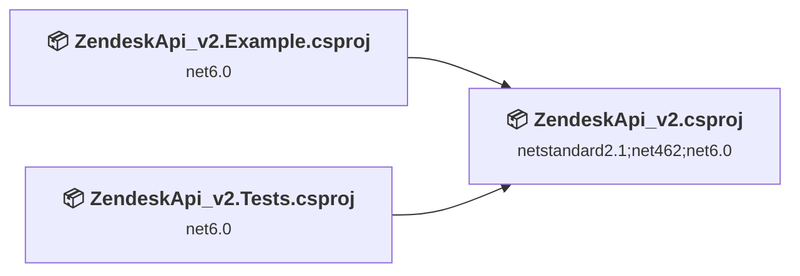
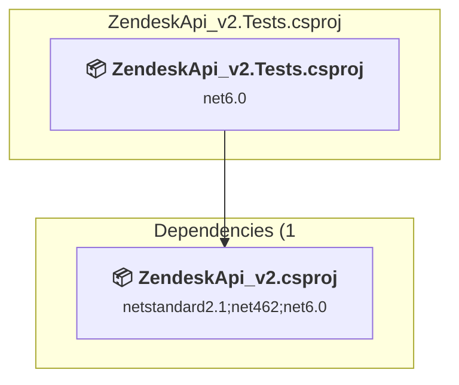
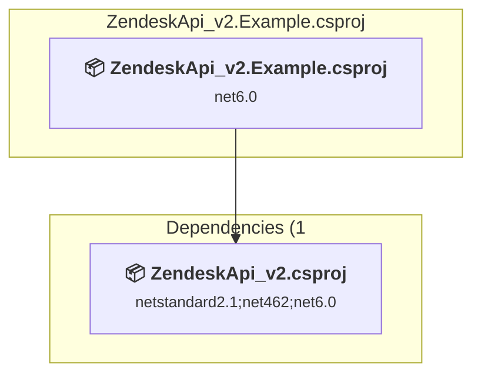
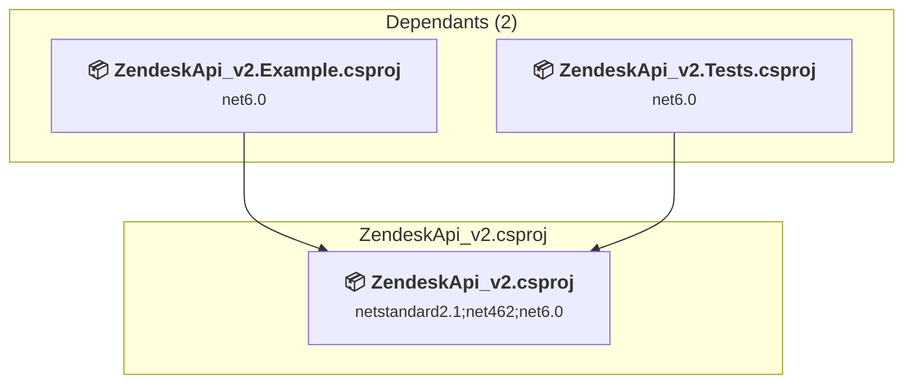

# Projects and dependencies analysis

This document provides a comprehensive overview of the projects and their dependencies in the context of upgrading to .NETCoreApp,Version=v8.0.

## Table of Contents

- [Executive Summary](#executive-Summary)
  - [Highlevel Metrics](#highlevel-metrics)
  - [Projects Compatibility](#projects-compatibility)
  - [Package Compatibility](#package-compatibility)
  - [API Compatibility](#api-compatibility)
- [Aggregate NuGet packages details](#aggregate-nuget-packages-details)
- [Top API Migration Challenges](#top-api-migration-challenges)
  - [Technologies and Features](#technologies-and-features)
  - [Most Frequent API Issues](#most-frequent-api-issues)
- [Projects Relationship Graph](#projects-relationship-graph)
- [Project Details](#project-details)

  - [C:\_git\personal\Speedygeek\ZendeskApi_v2\tests\ZendeskApi_v2.Tests\ZendeskApi_v2.Tests.csproj](#c:_gitpersonalspeedygeekzendeskapi_v2testszendeskapi_v2testszendeskapi_v2testscsproj)
  - [ZendeskApi_v2.Example\ZendeskApi_v2.Example.csproj](#zendeskapi_v2examplezendeskapi_v2examplecsproj)
  - [ZendeskApi_v2\ZendeskApi_v2.csproj](#zendeskapi_v2zendeskapi_v2csproj)

## Executive Summary

### Highlevel Metrics

| Metric | Count | Status |
| :--- | :---: | :--- |
| Total Projects | 3 | All require upgrade |
| Total NuGet Packages | 10 | 4 need upgrade |
| Total Code Files | 330 |  |
| Total Code Files with Incidents | 4 |  |
| Total Lines of Code | 22175 |  |
| Total Number of Issues | 10 |  |
| Estimated LOC to modify | 2+ | at least 0.0% of codebase |

### Projects Compatibility

| Project | Target Framework | Difficulty | Package Issues | API Issues | Est. LOC Impact | Description |
| :--- | :---: | :---: | :---: | :---: | :---: | :--- |
| [C:\_git\personal\Speedygeek\ZendeskApi_v2\tests\ZendeskApi_v2.Tests\ZendeskApi_v2.Tests.csproj](#c:_gitpersonalspeedygeekzendeskapi_v2testszendeskapi_v2testszendeskapi_v2testscsproj) | net6.0 | 🟢 Low | 3 | 0 |  | DotNetCoreApp, Sdk Style = True |
| [ZendeskApi_v2.Example\ZendeskApi_v2.Example.csproj](#zendeskapi_v2examplezendeskapi_v2examplecsproj) | net6.0 | 🟢 Low | 0 | 0 |  | DotNetCoreApp, Sdk Style = True |
| [ZendeskApi_v2\ZendeskApi_v2.csproj](#zendeskapi_v2zendeskapi_v2csproj) | netstandard2.1;net462;net6.0 | 🟢 Low | 2 | 2 | 2+ | ClassLibrary, Sdk Style = True |

### Package Compatibility

| Status | Count | Percentage |
| :--- | :---: | :---: |
| ✅ Compatible | 6 | 60.0% |
| ⚠️ Incompatible | 0 | 0.0% |
| 🔄 Upgrade Recommended | 4 | 40.0% |
| ***Total NuGet Packages*** | ***10*** | ***100%*** |

### API Compatibility

| Category | Count | Impact |
| :--- | :---: | :--- |
| 🔴 Binary Incompatible | 0 | High - Require code changes |
| 🟡 Source Incompatible | 2 | Medium - Needs re-compilation and potential conflicting API error fixing |
| 🔵 Behavioral change | 0 | Low - Behavioral changes that may require testing at runtime |
| ✅ Compatible | 26831 |  |
| ***Total APIs Analyzed*** | ***26833*** |  |

## Aggregate NuGet packages details

| Package | Current Version | Suggested Version | Projects | Description |
| :--- | :---: | :---: | :--- | :--- |
| GitVersion.MsBuild | 5.7 |  | [ZendeskApi_v2.csproj](#zendeskapi_v2zendeskapi_v2csproj) | ✅Compatible |
| Microsoft.Extensions.Configuration.Binder | 7.0.4 | 8.0.2 | [ZendeskApi_v2.Tests.csproj](#c:_gitpersonalspeedygeekzendeskapi_v2testszendeskapi_v2testszendeskapi_v2testscsproj) | NuGet package upgrade is recommended |
| Microsoft.Extensions.Configuration.EnvironmentVariables | 7.0.0 | 8.0.0 | [ZendeskApi_v2.Tests.csproj](#c:_gitpersonalspeedygeekzendeskapi_v2testszendeskapi_v2testszendeskapi_v2testscsproj) | NuGet package upgrade is recommended |
| Microsoft.Extensions.Configuration.UserSecrets | 7.0.0 | 8.0.1 | [ZendeskApi_v2.Tests.csproj](#c:_gitpersonalspeedygeekzendeskapi_v2testszendeskapi_v2testszendeskapi_v2testscsproj) | NuGet package upgrade is recommended |
| Microsoft.NET.Test.Sdk | 17.6.0 |  | [ZendeskApi_v2.Tests.csproj](#c:_gitpersonalspeedygeekzendeskapi_v2testszendeskapi_v2testszendeskapi_v2testscsproj) | ✅Compatible |
| Microsoft.SourceLink.GitHub | 1.1.1 |  | [ZendeskApi_v2.csproj](#zendeskapi_v2zendeskapi_v2csproj) | ✅Compatible |
| Newtonsoft.Json | 11.0.2 | 13.0.4 | [ZendeskApi_v2.csproj](#zendeskapi_v2zendeskapi_v2csproj) | NuGet package upgrade is recommended |
| NUnit | 3.13.3 |  | [ZendeskApi_v2.Tests.csproj](#c:_gitpersonalspeedygeekzendeskapi_v2testszendeskapi_v2testszendeskapi_v2testscsproj) | ✅Compatible |
| NUnit.Analyzers | 3.6.1 |  | [ZendeskApi_v2.Tests.csproj](#c:_gitpersonalspeedygeekzendeskapi_v2testszendeskapi_v2testszendeskapi_v2testscsproj) | ✅Compatible |
| NUnit3TestAdapter | 4.4.2 |  | [ZendeskApi_v2.Tests.csproj](#c:_gitpersonalspeedygeekzendeskapi_v2testszendeskapi_v2testszendeskapi_v2testscsproj) | ✅Compatible |

## Top API Migration Challenges

### Technologies and Features

| Technology | Issues | Percentage | Migration Path |
| :--- | :---: | :---: | :--- |

### Most Frequent API Issues

| API | Count | Percentage | Category |
| :--- | :---: | :---: | :--- |
| M:System.Net.WebRequest.Create(System.String) | 2 | 100.0% | Source Incompatible |

## Projects Relationship Graph

Legend:
📦 SDK-style project
⚙️ Classic project

## Project Details

### C:\_git\personal\Speedygeek\ZendeskApi_v2\tests\ZendeskApi_v2.Tests\ZendeskApi_v2.Tests.csproj

#### Project Info

- **Current Target Framework:** net6.0
- **Proposed Target Framework:** net8.0
- **SDK-style**: True
- **Project Kind:** DotNetCoreApp
- **Dependencies**: 1
- **Dependants**: 0
- **Number of Files**: 45
- **Number of Files with Incidents**: 1
- **Lines of Code**: 7533
- **Estimated LOC to modify**: 0+ (at least 0.0% of the project)

#### Dependency Graph

Legend:
📦 SDK-style project
⚙️ Classic project

### API Compatibility

| Category | Count | Impact |
| :--- | :---: | :--- |
| 🔴 Binary Incompatible | 0 | High - Require code changes |
| 🟡 Source Incompatible | 0 | Medium - Needs re-compilation and potential conflicting API error fixing |
| 🔵 Behavioral change | 0 | Low - Behavioral changes that may require testing at runtime |
| ✅ Compatible | 14149 |  |
| ***Total APIs Analyzed*** | ***14149*** |  |

#### Project Package References

| Package | Type | Current Version | Suggested Version | Description |
| :--- | :---: | :---: | :---: | :--- |
| Microsoft.Extensions.Configuration.Binder | Explicit | 7.0.4 | 8.0.2 | NuGet package upgrade is recommended |
| Microsoft.Extensions.Configuration.EnvironmentVariables | Explicit | 7.0.0 | 8.0.0 | NuGet package upgrade is recommended |
| Microsoft.Extensions.Configuration.UserSecrets | Explicit | 7.0.0 | 8.0.1 | NuGet package upgrade is recommended |
| Microsoft.NET.Test.Sdk | Explicit | 17.6.0 |  | ✅Compatible |
| NUnit | Explicit | 3.13.3 |  | ✅Compatible |
| NUnit.Analyzers | Explicit | 3.6.1 |  | ✅Compatible |
| NUnit3TestAdapter | Explicit | 4.4.2 |  | ✅Compatible |

### ZendeskApi_v2.Example\ZendeskApi_v2.Example.csproj

#### Project Info

- **Current Target Framework:** net6.0
- **Proposed Target Framework:** net8.0
- **SDK-style**: True
- **Project Kind:** DotNetCoreApp
- **Dependencies**: 1
- **Dependants**: 0
- **Number of Files**: 2
- **Number of Files with Incidents**: 1
- **Lines of Code**: 107
- **Estimated LOC to modify**: 0+ (at least 0.0% of the project)

#### Dependency Graph

Legend:
📦 SDK-style project
⚙️ Classic project

### API Compatibility

| Category | Count | Impact |
| :--- | :---: | :--- |
| 🔴 Binary Incompatible | 0 | High - Require code changes |
| 🟡 Source Incompatible | 0 | Medium - Needs re-compilation and potential conflicting API error fixing |
| 🔵 Behavioral change | 0 | Low - Behavioral changes that may require testing at runtime |
| ✅ Compatible | 79 |  |
| ***Total APIs Analyzed*** | ***79*** |  |

### ZendeskApi_v2\ZendeskApi_v2.csproj

#### Project Info

- **Current Target Framework:** netstandard2.1;net462;net6.0
- **Proposed Target Framework:** netstandard2.1;net462;net6.0;net8.0
- **SDK-style**: True
- **Project Kind:** ClassLibrary
- **Dependencies**: 0
- **Dependants**: 2
- **Number of Files**: 285
- **Number of Files with Incidents**: 2
- **Lines of Code**: 14535
- **Estimated LOC to modify**: 2+ (at least 0.0% of the project)

#### Dependency Graph

Legend:
📦 SDK-style project
⚙️ Classic project

### API Compatibility

| Category | Count | Impact |
| :--- | :---: | :--- |
| 🔴 Binary Incompatible | 0 | High - Require code changes |
| 🟡 Source Incompatible | 2 | Medium - Needs re-compilation and potential conflicting API error fixing |
| 🔵 Behavioral change | 0 | Low - Behavioral changes that may require testing at runtime |
| ✅ Compatible | 12603 |  |
| ***Total APIs Analyzed*** | ***12605*** |  |

